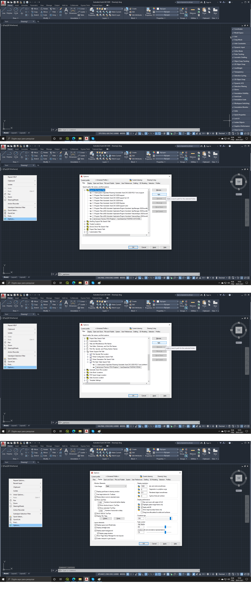

# AutoCAD 
It is a commercial computer-aided design and drafting software application released in 1982.

After installation, add [Autodesk Genuine Service](https://youtu.be/xqEnDpikZdw) by
extracting `Autodesk Genuine Service.rar`, run it, click on "remove". Done!

### 2d 3d Tutorial _Create a house project_ with Awais Mirza
Content of the [video](https://youtu.be/-7hrElZrul4):
- Lines, Circles, Rectangles
- Hatching
- Dimensioning
- Annotation
- Attributes
- Tables
- External references
- Layouts
- Create output

- 3d Drawing
```
set DEFAULTGIZMO to 0
shift+rightClick -> snap options
```
- Show lineweight
```
LWDISPLAY 1
```

> To manipulate polygon vectors as in QGIS way, transforms bound-polygons to regions (Home > Draw > Region) 
and the operations can be used UNION, INTERSECT, DIFFERENCE (boolean operations)

- Divide line in # equal blocks:
```
DIVIDE, select object, set #   [DDTP to change the point appearance, otherwise the divisions cannot be seen]
```

- Status bar -> "Restric cursor to specified angles" <- nice feature
- Text
```autocad
# First, create style
STYLE
# Create new, choose Font Name, width factor 0.8 looks cool
TEXT, height is the FontSize
``` 
```
- At the end, to draw dimension,
Home > Dimensions > New Dimension Style 
(it makes easier to add several dimensions)
```
- Match Property acts like Excel's Format Brush

> Good Practice: Create layers at the start of your drawing
Wall, Interior, Doors, Windows, ...
(Layer walk helps at the end of project to check if every object is sound in the right layer)
(Layer state presets on/off combinations. Usefull to change fast between layer groups: floor plan, 1st floor plan, ...etc)

- Blocks are used to create pattern objects and recreate them several times. If the block drawing (double click on it) is changed, all the blocks change equally
> Inside the block drawing, it is possible to add "dynamic movements" to the block. Door example with flip, rotate and scale. Easier to reproduce several.

# Design Center (ctrl+2)

# Content Explorer is Design Center but online with a lot of Blocks

# Tables can be created as well to keep dimensions summarized

# to Print
Output > Page Setup Manager
MVIEW > click to delimit it where to plot on the Layout tab

### TIPS I LEARNED

The format extensions DWT and DWG are practically the same, 
but DWT is used to set a standard to projects ([source](https://www.augi.com/articles/detail/tipniques-why-you-should-use-a-template#:~:text=The%20most)).
> "Template files provide users a place to start.
Not only do they give a starting point, but they also 
force your team to be a team.  A properly executed template file, or series of template files, 
will instill standardization increase efficiency." 


EXPERT 1		(disables "the current layer will be turned off...")
H (hatch), ENTER, Match Properties -> select the source-hatch, click within the polygon to be hatched

Super hatch (https://youtu.be/NYjgWuiD8oc)
criar hatch como .txt, trocar extensão para .pat, adicionar
No AutoCAD, botão direito na tela de desenho, Options, 
Files, Expand "Support File Search Path", "Add...", "Browse", Select the DIR where you saved the custom .pat

C:\Program Files\Autodesk\AutoCAD 2016\UserDataCache\en-us\Support\acad.pat

NBR 17025
Limite de quantificação dos ensaios
(LQ e Faixas de trabalho adicionadas aos parâmetros, rede metrológica)

MRC - Material de Referencia

- Add "pena" to new page (aba), right-click>Page Setup Manager

1º Nível: PT - Procedimentos gerais sobre matrizes
2º Nível: IT - Sub-Documento específico de uma matriz
3º Nível: FT - Sub-Sub-Documento 

Relato de Resultados

import csv to autocad:
save as .scr with the following format:

Point X,Y
Point X,Y
Point X,Y
Point X,Y
Point X,Y
Point X,Y
Point X,Y
Point X,Y


### AutoCAD and QGIS
create point layer, toggle editing, create fields lat lon nome,
field calculator $x for lon, and $y for lat (update existing field)

Custom Hatch
Right-click on drawing > Options > Files > Support File Search Path > add new path to "*.pat"

hatch syntax:

*pattern-name[, description]

angle, x-origin,y-origin, delta-x,delta-y [, dash1, dash2, …]

Hatch-pattern definitions have a few rules:
- The description is optional; if you include one, precede it with a comma.
- Add the dash specifications only for noncontinuous lines.
- You can have more than one definition line (the second line in the syntax I just showed), creating sets of hatch definitions that combine to create the hatch pattern.
- Each definition line can be no more than 80 characters.
- You can include a maximum of six dash specifications (which include spaces and dots).
- You can add spaces in the definition lines for readability.

Imagem Google Earth para o AutoCAD
- Abrir Google Earth, focar na área, Visualizar>Redefinir>Inclinação e Bússola
- Adicionar dois pontos extremos bem identificáveis (anotando os pontos Long e Lat)
- Garantir que esteja no UTM (Ferramentas>Opções>Mostrar Lat/long: UTM)
- Clicar no ícone salvar imagem para exportar.
== No AutoCAD, 
- ctrl+V ou attach.
- criar dois Point com as mesmas coordenadas.
- Allign > selecionar a imagem > selecionar o primeiro ponto, segundo ponto e no terceiro dar enter, marcar que quer redimensionar o objeto.

Importar pro QGIS:
- Salvar arquivo como .dxf
- Arrastar pro QGIS
- Se polígono, Vector > Geometry tools > Line to Polygon
- Export > Save feature as > ESRI shapefile


### ERRORS
#### ERROR - Product license - Out of time

"License checkout timed out. What do you want to do?"
Services:
- den Dienst "Autodesk Desktop Licensing Service" beenden und wieder starten
- den Dienst "FlexNet Licensing Service" beenden und wieder starten

#### AVISO: "A licença do autocad que você está usando não é válida"

1. Fechar o AutoCAD,
2. Ctrl+Shift+Esc > Inicializar > Desabilitar o Autodesk Dektop App (e, se tiver, Autodesk Genuine Service)
3. Clicar com o botão direito e abrir local do arquivo desses desabilitados, copiar esses caminhos para um bloco de notas.
4. Abrir local do arquivo do AutoCAD, copiar esse caminho para o bloco de notas

5. Windows Defender Firewall com Segurança Avançada
6. Adicionar regras de entrada e saída para bloquear os arquivos nos caminhos anotados
7. Regras de Entrada > Nova Regra... > Programa > Caminho do programa (pasta do Autocad) > Bloquear conexão > Três opções marcadas > Dar um nome oportuno
8. Regras de Saída > Nova Regra... > Programa >  Caminho do programa (pasta do Autocad) > Bloquear conexão > Três opções marcadas > Dar um nome oportuno

LÖSUNG: Windows Services öffnen und die folgenden Dienste neustarten: `Autodesk Desktop App Service`,
`Autodesk Desktop Licensing Service` und `FlexNet Licensing Service`.

### MY PERSONAL ADJUSTMENTS
<div align="center"></div>
