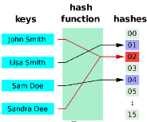

# Structured Query Language (SQL)

**Data Manipulation Language ([DML](https://docs.getdbt.com/terms/dml))** is a class of SQL statements that are 
used to query, edit, add and delete row-level data from database tables or views. 
The main DML statements are `SELECT`, `INSERT`, `DELETE`, and `UPDATE`.

DML is contrasted with **Data Definition Language ([DDL](https://docs.getdbt.com/terms/ddl))** which is a series of 
SQL statements that you can use to edit and manipulate the structure of 
databases and the objects in them. The main DDL are `ALTER`, `DROP`, `CREATE`, `TRUNCATE`.

PostgreSQL, MS Access and Oracle are **r**elational **d**atabase **m**anagement **s**ystems (RDBMS) that support the SQL language. In SQL, a **PRIMARY KEY** identifies uniquely each register in a table and may be used to associate differente tables. **FOREIGN KEYS**, on the other hand, are the link to associate to other table's **PRIMARY KEY**. A **PRIMARY KEY** and its counterpart, the **FOREIGN KEY**, must be of the same **data type**.

- Sheetcode for PostgreSQL
```SQL
-- Show databases
\list

-- Connects to <database_name>
\c <database_name>

-- Prints postgresql version
SELECT version();

-- Prints PostGIS version (must be in a db with postgis)
SELECT PostGIS_full_version();
```

On Linux

ALTER USER postgres PASSWORD 'new_password';


Create a database with PostGIS
```SQL
CREATE DATABASE db_w_postgis;
\c db_w_postgis;
CREATE EXTENSION postgis;
```

Create a new user with specific permissions
```SQL
CREATE USER django WITH PASSWORD 'django';
GRANT CONNECT ON DATABASE db_w_postgis TO django;
GRANT USAGE ON SCHEMA public TO django;
GRANT SELECT, INSERT, UPDATE, DELETE ON ALL TABLES IN SCHEMA public TO django;
ALTER DEFAULT PRIVILEGES IN SCHEMA public GRANT SELECT, INSERT, UPDATE, DELETE ON TABLES TO django;
```
Allow outside connections:  
In PostgreSQL's directory make sure `data/postgresql.conf` is listening all addresses: `listen_addresses = '*'`; and that `pg_hba.conf` allow all ips connections `host all all 0.0.0.0/0 md5`.

Restart PostgreSQL service in Windows (substitute XX with the version)
```Bat
net stop postgresql-x64-XX
net start postgresql-x64-XX
```

If statements in SQL
```SQL
SELECT 
   IIF(ISNULL(tab12.column1), 'N.A.', column1) as alias1,
   tab12.column2
FROM 
   tab1 LEFT JOIN tab2 ON tab1.id = tab2.id AS tab12
WHERE
   column2 IS NOT NULL AND column2 NOT LIKE 'Po*';
```


Microsoft Access
O Microsoft Access (MS Access) é um aplicativo dentro da família Microsoft Office. Ele combina a Microsoft Jet Engine como sistema de gerenciamento de banco de dados com as ferramentas de um ambiente de desenvolvimento integrado, cuja interface gráfica é particularmente adequada para o grupo alvo de usuários finais para a produção de aplicações de banco de dados.
O MS Access suporta (com algumas limitações) a linguagem de banco de dados SQL a partir da versão 2007.
O MS Access pode servir para armazenamentos de dados de um projeto, facilitando consultas de dados de diferentes campanhas. 

Insert Data in Microsoft Access
- From Excel  
External Data > New Data Source > From File > Excel  
Follow the wizard (watch out for correct [Data Types](https://support.microsoft.com/pt-br/office/tipos-de-dados-para-bancos-de-dados-da-%C3%A1rea-de-trabalho-do-access-df2b83ba-cef6-436d-b679-3418f622e482) because Access might misinterpret the field since it infers from the first registers). For instance, **SHORT_TEXT** is up to 255 characters. While **LONG_TEXT** permits up to 1GB, Access only supports showing up to 64k characters.  
**Access** either (1) adds a **PRIMARY KEY**, (2) asks you to pick one, or (3) insert a table without **PRIMARY KEY**.
> If anything goes wrong while importing data, a table named “NAME$_importError”will show up
 


When and what fields to index?
- Index fields that are called frequently. This may accelerate queries, but also slows the process of inserting and updating data. Every time a index table has a change, it must updates the indexes — [more here](https://support.microsoft.com/pt-br/office/criar-e-usar-um-%C3%ADndice-para-melhorar-o-desempenho-0a8e2aa6-735c-4c3a-9dda-38c6c4f1a0ce). Indexed registers are normally processed by a *hash-function* and consequently operate under O(1) speed when queried.
<div align="center">

</div>