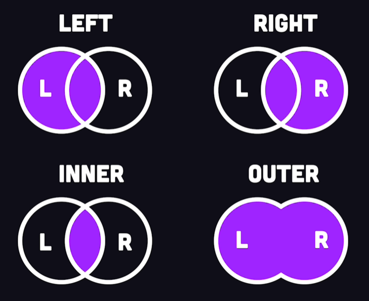

# Structured Query Language (SQL)
PostgreSQL, MS Access & Oracle are **R**elational **D**atabase **M**anagement **S**ystems (RDBMS) that support the SQL language. In SQL, a **PRIMARY KEY (PK)** identifies uniquely each register in a table and may be used to associate differente tables. **FOREIGN KEYS (FK)**, on the other hand, are the link to associate to other table's **PK**. A **PK** and its counterpart, the **FK**, must be of the same **data type**.

Fake data to practice: https://www.mockaroo.com/  
DrawSQL https://drawsql.app/  
Draw diagrams https://app.diagrams.net/

##  
Invented at the Berkeley Computer Science Department, University of California, it started as a project in 1986 with the goal of creating a database system with the minimal features needed to support multiple data types.

PSQL is a frontend terminal for PostgreSQL. You can set  environment variables (`PGDATABASE, PGHOST, PGPORT, PGUSER, PGPASSWORD`). For additional environment variables, see Section 34.15. It is also convenient to have a ~/.pgpass file.

|Command|Description|
|---|---|
|\list|list databases in server|
|\c <db_name> | connects to the database
|\?|internal Statement, like "\copy" or "\list"|
|\h|SQL-Statements|

**Data Manipulation Language ([DML](https://docs.getdbt.com/terms/dml))** is a class of SQL statements that are 
used to query, edit, add and delete row-level data from database tables or views. 
The main DML statements are `SELECT`, `INSERT`, `DELETE`, and `UPDATE`.
```sql
-- SELECT
-- General select statement
SELECT * FROM table1 WHERE uf IN ('SP', 'MG', 'RJ') ORDER BY first_name DESC LIMIT 3;
SELECT * FROM table1 LIMIT 20 OFFSET 40;
SELECT DISTINCT country FROM customers;
SELECT COUNT(DISTINCT country) AS no_countries FROM customers;
-- Check versions
SELECT version() AS "Versao PostgreSQL"; -- Alias with space require double quotes
SELECT PostGIS_full_version();
-- Check information schema
SELECT column_name, data_type FROM information_schema.columns WHERE table_name = 'table';

-- INSERT
INSERT INTO cars (brand, model, year) 
VALUES ('Volvo', 'p1800', 1968), ('BMW', 'M1', 1978); -- many tuples can be given

-- DELETE accepts WHERE & logs row deletions
DELETE FROM cars WHERE brand = 'Volvo';

-- UPDATE
UPDATE table1 SET column1 = 'str1' WHERE column2 = 'str2';
```
**Data Definition Language ([DDL](https://docs.getdbt.com/terms/ddl))** contrasts DML in that it is a series of 
SQL statements that you can use to edit and manipulate the structure of 
databases and the objects in them. The main DDL are `ALTER`, `DROP`, `CREATE`, `TRUNCATE`. A column might have constraints: `UNIQUE`, `NOT NULL`, `PRIMARY KEY`, `ENUM`.
```SQL
-- ALTER
ALTER USER postgres PASSWORD 'new_password';
-- Alter field
ALTER TABLE table1 ALTER COLUMN price TYPE DOUBLE PRECISION;
ALTER TABLE table1 ADD username VARCHAR(255);
ALTER TABLE table1 DROP COLUMN price;

-- DROP
DROP table1;

-- CREATE
-- Create a database
CREATE DATABASE db_w_postgis;
-- Add extension
CREATE EXTENSION postgis;  -- must be connected to the database
-- Create table
CREATE TABLE table1 (
   id SERIAL NOT NULL PRIMARY KEY,
   customer_id INT UNIQUE,
   first_name VARCHAR(255),  -- 255 (1 byte) is the limit of one memory unit to point to
   price FLOAT,
   ip_address VARCHAR(15),
   latitude DOUBLE PRECISION,
   longitude DOUBLE PRECISION,
   active BOOLEAN,
   register_date DATE
);
-- By setting a foreign key referencing Users, those Users appearing in Rooms cannot be deleted.
CREATE TABLE Rooms (
    id SERIAL PRIMARY KEY,
    street VARCHAR(255),
    owner_id INT NOT NULL,
    FOREIGN KEY (owner_id) REFERENCES Users(id)
);
-- Indexes accelerate queries using column1, but slows down the write-time.
CREATE INDEX column1_index ON table1(column1);

-- TRUNCATE
TRUNCATE TABLE cars; -- remove all registers & dont log row deletions

-- Insert in table from csv (\copy bypass restrictions)
COPY table1 FROM '.../datei.csv' DELIMITER ',' CSV HEADER ENCODING 'UTF-8';

-- Create a new user with specific permissions
CREATE USER django WITH PASSWORD 'django';
GRANT CONNECT ON DATABASE db_w_postgis TO django;
GRANT USAGE ON SCHEMA public TO django;
GRANT SELECT, INSERT, UPDATE, DELETE ON ALL TABLES IN SCHEMA public TO django;
ALTER DEFAULT PRIVILEGES IN SCHEMA public GRANT SELECT, INSERT, UPDATE, DELETE ON TABLES TO django;
```
### Operators in WHERE clause:  
 `=`, `<`, `>`, `<=`, `=>`,  
 `<>` (ISO-conform), `!=` (not conform),  
  `LIKE`, `ILIKE` (case insentive),  
  `AND`, `OR`, `IN`, `BETWEEN...AND` (works for numeric, text and dates), `IS NULL`, `NOT`.
```SQL
-- '%' and '_' are often used in conjunction with LIKE
-- '_' the underscore sign represents one, single character
-- '%' The percent sign represents zero, one, or multiple characters
-- Select Eduardo and Eduarda
SELECT * FROM customers
WHERE customer_name LIKE 'Eduard_';
-- Names ending with a
SELECT * FROM customers
WHERE customer_name ILIKE '%a';
```
### Other operators
Columns can be concatenated with `||`:  
`SELECT product_name || ' ' || unit AS product
FROM products;`

### SQL Functions
- AGGREGATION FUNCTIONS

They tipically ignore NULL values.  
COUNT, MIN, MAX, SUM, AVG.  
Function outputs can be cast or transformed with the `::` operator:
```SQL
-- Round the output to 2 decimals
SELECT AVG(price)::NUMERIC(10,2) FROM products;
```

### TRIGGERS


### Joins
<div align="center">
  
</div>

```SQL
-- INNER
SELECT testproduct_id, product_name, category_name
FROM testproducts
INNER JOIN categories ON testproducts.category_id = categories.category_id;

-- LEFT
SELECT testproduct_id, product_name, category_name
FROM testproducts
LEFT JOIN categories ON testproducts.category_id = categories.category_id;

-- RIGHT
SELECT testproduct_id, product_name, category_name
FROM testproducts
RIGHT JOIN categories ON testproducts.category_id = categories.category_id;

-- FULL
SELECT testproduct_id, product_name, category_name
FROM testproducts
FULL JOIN categories ON testproducts.category_id = categories.category_id;

-- CROSS JOIN permutes the 'n-rows' of table1 with 'm-rows' of table2
SELECT testproduct_id, product_name, category_name
FROM testproducts
CROSS JOIN categories;
```

### UNION ALL
The queries in the union must result in tables 
with the same number of columns, data types and order. To accept duplicated, change `UNION` for `UNION ALL`
```SQL
SELECT product_id
FROM products
UNION [ALL]
SELECT testproduct_id
FROM testproducts
ORDER BY product_id;
```

### The GROUP BY clause
It groups rows that have the same values into summary rows, like "find the number of customers in each country". 

The GROUP BY clause is often used with aggregate functions like COUNT(), MAX(), MIN(), SUM(), AVG() to group the result-set by one or more columns. `WHERE` cannot be used with `GROUP BY`. Because if this, `HAVING` was added.
```SQL
SELECT COUNT(customer_id), country FROM customers GROUP BY country [HAVING country LIKE 'I%'] [ORDER BY country];
```

### EXISTS/NOT EXISTS
The EXISTS operator is used to test for the existence of any record in a sub query.

The EXISTS operator returns TRUE if the sub query returns one or more records.

SELECT customers.customer_name
FROM customers
WHERE EXISTS (
  SELECT order_id
  FROM orders
  WHERE customer_id = customers.customer_id
);

### ANY & ALL
The ANY/ALL operator:
- returns a Boolean value as a result
- returns TRUE if ALL of the sub query values meet the condition
- is used with SELECT, WHERE and HAVING statements
```SQL
-- Select products that have more than 10 orders
SELECT product_name FROM products
WHERE product_id = ALL (
  SELECT product_id FROM order_details
  WHERE quantity > 10
  );
```

### CASE
The CASE expression goes through conditions and returns a value when the first condition is met (like an if-then-else statement).

Once a condition is true, it will stop reading and return the result. If no conditions are true, it returns the value in the ELSE clause.

If there is no ELSE part and no conditions are true, it returns NULL.
```SQL
-- Case example with alias
SELECT product_name,
CASE
  WHEN price < 10 THEN 'Low price product'
  WHEN price > 50 THEN 'High price product'
ELSE
  'Normal product'
END AS "price category"
FROM products;
```

### DATASPACE

## Allow outside connections
In PostgreSQL's dir make sure `data/postgresql.conf` is listening all addresses: `listen_addresses = '*'`; and that `pg_hba.conf` allow all ips connections `host all all 0.0.0.0/0 md5`.

Restart PostgreSQL service in Windows 
```cmd
rem (substitute XX with the version)
net stop postgresql-x64-XX
net start postgresql-x64-XX
```

If statements in SQL
```SQL
SELECT 
   IIF(ISNULL(tab12.column1), 'N.A.', column1) as alias1,
   tab12.column2
FROM 
   tab1 LEFT JOIN tab2 ON tab1.id = tab2.id AS tab12
WHERE
   column2 IS NOT NULL AND column2 NOT LIKE 'Po*';
```


## 
Microsoft Access is part of Microsoft Office. It joins the Microsoft Jet Engine as RBDMS with IDE tools, which GUI is specially adequate for targetting DB user groups. MS Access supports (to a certain degree) SQL from version 2007 on. The system is for entry-level size databases. 

Insert Data in Microsoft Access
- From Excel  
External Data > New Data Source > From File > Excel  
Follow the wizard (watch out for correct [Data Types](https://support.microsoft.com/pt-br/office/tipos-de-dados-para-bancos-de-dados-da-%C3%A1rea-de-trabalho-do-access-df2b83ba-cef6-436d-b679-3418f622e482) because Access might misinterpret the field since it infers from the first registers). For instance, **SHORT_TEXT** is up to 255 characters. While **LONG_TEXT** permits up to 1GB, Access only supports showing up to 64k characters.  
**Access** either (1) adds a **PRIMARY KEY**, (2) asks you to pick one, or (3) insert a table without **PRIMARY KEY**.
> If anything goes wrong while importing data, a table named “NAME$_importError”will show up
 


When and what fields to index?
- Index fields that are called frequently. This may accelerate queries, but also slows the process of inserting and updating data. Every time a index table has a change, it must updates the indexes — [more here](https://support.microsoft.com/pt-br/office/criar-e-usar-um-%C3%ADndice-para-melhorar-o-desempenho-0a8e2aa6-735c-4c3a-9dda-38c6c4f1a0ce). Indexed registers are normally processed by a *hash-function* and consequently operate under O(1) speed when queried.
<div align="center">

</div>