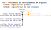

# Git - File versioning tool
<div align="center">

</div>

### Introduction:
> Git is a popular version control tool used globally, often accessed through **git-bash**.
It helps to keep track of changes in a project and to keep licensing (LICENSE) and 
documentation (README.md). Git-bash is a linux-like terminal and works with git commands.
The analogy below with commands in bold and figurative boxes and warehouse explains git.  
> 
> `brzrkr's analogy:`
> while **stage** puts stuff in a box, **commit** closes the box and stick a label on it. 
Further, **push** sends all the closed boxes off to the warehouse (remote), 
there they're out of your control. **pull** asks the warehouse to bring the new boxes to an existing location; 
**clone** makes a copy of the entire warehouse and bring it to a new location. 
> 
> Let's get it!

1) [Download Git-bash for Windows](https://git-scm.com/download/win) 
(On installation, always select the default)
2) ... and then "Who are you?"; set the main settings:
```
# Add your Name and Email
	git config --global user.name "My Name"
	git config --global user.email "myemail@example.com"
# Check your Name and Email
	git config --global user.name
	git config --global user.email
```
---
## Glossary
| Concept           | Description                                               |
|-------------------|-----------------------------------------------------------|
 | remote repository | Online (like a warehouse)                                 |
 | local repository  | Local (like a storage room)                               |
 | branch            | When main bifurcates to a new line in same repo           |
 | clone             | A replica of someone else's project/repo stored in local  |
| fork              | A replica of someone else's project/repo stored in remote |

---

## Recurrent tasks
#### **SSH connections**
WSL2 requires `git clone` over SSH instead of HTTPS. To accomplish it, go to the current WSL home directory and type  
```bash
# Make SSH dir
mkdir .ssh
cd .ssh

# Create key-pair w algorithm ed25519 OR rsa
ssh-keygen -t ed25519 -C "user@email"

# Create config file
touch config
nano config

# Might be necessary to activate the Agent 
eval "$(ssh-agent -s)"

# # Default GitHub
# Host github.com
#     HostName github.com
#     PreferredAuthentications publickey
#     IdentityFile ~/.ssh/<a_name>

# Check is ssh is registered:
ssh-add -l

# If not:
ssh-add <algorithm used> 

# Test:
ssh -T git@github.com
# Test passed if 
# "Hi <name>! You've successfully authenticated, but GitHub does not provide shell access."
```

```
eval "$(ssh-agent -s)"
ssh-add ~/.ssh/<a_name>
cat id_ed25519.pub
# Copy the content, and register it as Authentication Key in GitHub
# This is in GitHub > Settings > SSH and GPG keys
# Now go to the repository and copy not the HTTPS but SSH to git clone
```


#### **Points that may be tackled in a README.md**
* What is the project about? What does this do?
* What are the dependencies and environment requirements?
* How does it work? (Does it operate continuously, or at specific hours?)
* Any additional documentation?
* Any guideline to set it from staging to production?

#### **When local does not exist**
```
# "PULL the box from the warehouse (remote) to a brand new storage room"
	git clone <LINK>
```

#### **Create new local from scratch** - The steps below come from [this source](https://docs.github.com/en/get-started/importing-your-projects-to-github/importing-source-code-to-github/adding-locally-hosted-code-to-github)
```
# 1) Create a new repository on GitHub.com. To avoid errors, 
do not initialize the new repository with README, license, 
or gitignore files. You can add these files after your 
project has been pushed to GitHub

# 2) Open Git Bash

# 3) Change the current working directory to your  local project

# 4) Initialize the local directory as a Git repository with main branch named 'main'
	git init -b main

# 5) Add .gitignore to signalize files that must not go to remote
	git add .gitignore

# 6) Add the files to be sent to remote. This stages everything bar the ones in gitignore for the first commit 
	git add .

# To unstage a file, use 'git reset HEAD <YOUR-FILE>'

# 7) Commit the files that you've staged in your local repository.
	git commit -m "<A name for your commit (typical names: first commit, fixed X, implemented Y)"

# This commits the tracked changes and prepares them to be pushed to a remote repository.
# To remove a commit and modify the file, use 'git reset --soft HEAD~1', and commit and add the file again.

# 8) At the top of your repository on GitHub.com's Quick Setup page, click to copy the remote repository URL.
Copy remote repository URL field

# 9) In the Command prompt, add the URL for the remote repository where your local repository will be pushed.
   	# Sets a remote called origin via its URL
	git remote add origin REMOTE_URL

	# Verifies the remotes	
	git remote -v

# 10) Push the changes in your local repository up to the remote repository you specified as "origin"
	git push origin main
```

#### **When local already exists**
```
# "PULL the box back from the warehouse to the storage room" 
	git pull origin main

# "PUSH the box from the storage room into the warehouse (remote)"
# .gitignore is used to ignore certain dev files
	git add .gitignore
	git add .
	git commit -m "<summarizing commit name>"
	git push origin main
```

#### **Change commit messages**
```
# Edit commit messages
	git commit --amend

# Change your text editor (example with atom and wait git until editor closes)
	git config --global core.editor "atom --wait"
```
---
## Sheetcode - Fundamentals

| Command                             | Description                                                         |
|-------------------------------------|---------------------------------------------------------------------|
| clear                               | Clear the terminal                                                  |
| git --help                          | Your best friend                                                    |
| git add                             | Stage files                                                         |
| git commit                          | Commits staged files                                                |
| git push                            | Pushes commit to remote                                             |
| git pull                            | Pulls Pushes commit to remote                                       |
| git remote add <tag> <remote_url>   | Adds a remote by a tag (eg. origin)                                 |
| git status                          | Presents git actual state                                           | 
| git branch -M "name"                | Renames the actual branch to name                                   | 
| checkout -b "name"                  | Creates and ch to a new branch one is about to start working with   | 
| pull request                        | When I make a change and want to suggest the owner                  | 
| merge "branchname"                  | Merges the branch to the connected one                              | 
| git rm --cache -r <file/dir>        | Removes the file/dir from cache (from the boxes) but not from local | 

### Known Errors
| Warning                     | Fix                                     | Source                                                                                                                    |
|-----------------------------|-----------------------------------------|---------------------------------------------------------------------------------------------------------------------------|
| LF will be replaced by CRLF | git config --global core.autocrlf false | https://stackoverflow.com/questions/17628305/windows-git-warning-lf-will-be-replaced-by-crlf-is-that-warning-tail-backwar |


### File history
| Action   | Date              |
|----------|-------------------|
| Creation | August 12th, 2022 |
| Modified | May 4th, 2023     |
