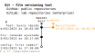

# [Git](https://en.wikipedia.org/wiki/Git) - File versioning control tool

It helps to track changes in a project. You can [download](https://git-scm.com/download/win)
**git-bash** for Windows (or `winget install --id Git.Git -e --source winget`), a Linux-like terminal that supports git commands (I always select the default installation, except for the editor).

- Repositories (repo): **remote** (online) or **local** (in machine)
- Copying repo: **clone** (replica stored in local) or **fork** (replica stored in remote)
- A **branch** is a bifurcation from another branch.

Tell git who you are:
```bash
# Add your Name and Email
git config --global user.name "My Name"
git config --global user.email "myemail@example.com"
# Check your Name and Email
git config --global user.name
git config --global user.email
```
The analogy below with commands in bold and figurative boxes and warehouse explains git.
> `brzrkr's analogy:`
 while **stage** puts stuff in a box, **commit** closes the box and stick a label on it. 
Further, **push** sends all the closed boxes off to the warehouse (remote), 
there they're out of your control. **pull** asks the warehouse to bring the new boxes to an existing location; 
**clone** makes a copy of the entire warehouse and bring it to a new location. 
---
<div align="center">
  
</div>

## Sheetcode - Fundamentals

| Command                             | Description                                                         |
|-------------------------------------|---------------------------------------------------------------------|
| git --help                          | Your best friend                                                    |
| git add .                           | Stage all files                                                     |
| git commit                          | Commits staged files                                                |
| git commit -am "<msg"               | Stage all files and commit                                          |
| git revert <commit-hash>            | Reverts to that commit (`git log --oneline` shows commits hashes)   |
| git push                            | Pushes commit to remote                                             |
| git pull                            | Pulls Pushes commit to remote                                       |
| git remote add <tag> <remote_url>   | Adds a remote by a tag (eg. origin)                                 |
| git status                          | Presents git actual state                                           | 
| git branch -M "name"                | Renames the actual branch to name                                   | 
| checkout -b "name"                  | Creates and ch to a new branch one is about to start working with   | 
| pull request                        | When I make a change and want to suggest the owner                  | 
| merge "branchname"                  | Merges the branch to the connected one                              | 
| git rm --cache -r <file/dir>        | Removes the file/dir from cache (from the boxes) but not from local | 
---
# SSH connections
( WSL2 requires `git clone` over SSH instead of HTTPS )  
```bash
# On Windows, use git-bash; on Linux, terminal
# Create .ssh dir at user root
mkdir -p ~/.ssh && cd ~/.ssh  # Linux-like
mkdir %userprofile%\.ssh && cd %userprofile%\.ssh  # Windows

# Create key-pair with algorithm ed25519 or RSA
ssh-keygen -t ed25519 -C "user@domain.com"   
## > Type a <FILENAME>
## > Set a passphrase for security  
#   two files are created: "id" and "pub" key  

# Add the SSH key to the host (eg GitLab, GitHub)
#  Copy the content of the public key  
#    Example:
#     ssh-ed25519 AAAAB3NzaC1lZDI1NTE5AAAAIA6TNgU7u8PHusSNKyPi1myBVCDuBs8ZYnMGgFVW/NfA user@email  
cat FILENAME.pub    # Linux
type FILENAME.pub   # Windows
#  Add SSH key (Settings > SSH and GPG keys > New SSH key)
#  Give it a Title, Key type is "Authentication Key" and paste Key.  
```
Additionally, you can set a config file so that git knows what username to use for each domain when using the SSH protocol:
```bash
# CREATE CONFIG FILE (optional)  
nano config  

#--------------------------------------------#  
# GitHub  
Host github.com  
    PreferredAuthentications publickey  
    IdentityFile ~/.ssh/<FILENAME_not_pub>  
   
# GitLab - Other domain  
Host gitlab.company.com.br  
    PreferredAuthentications publickey  
    IdentityFile ~/.ssh/<FILENAME_not_pub>  
#--------------------------------------------#  
```
To test the connections and/or avoid writing the passphrase many times in the same session, you can set up an agent
```bash
# LET AN AGENT HOLD THE SSH KEY PASSPHRASE
# Activate the agent  
eval "$(ssh-agent -s)"  # Linux  
eval $(ssh-agent)       # Windows (git-bash)  

# Check if SSH is registered  
ssh-add -l 

# If it is  not, add the private file (not the .pub):  
ssh-add <FILENAME_not_pub>  

# TEST CONNECTION
ssh -T git@<DOMAIN>  
# ( Sometimes a Warning of a new fingerprint is fired. User is prompted to accept it: 
#   "Hi <name>! You've successfully authenticated, but GitHub does not provide shell access.")
```

# Dev-Workflow in a git repository
Identify whether you will work in a:
- feature: _a new feature for the upcoming release_.
- bugfix: _fix a bug that has been identified in the main codebase._
- hotfix: _quickly fix a critical issue in the production code. Cannot wait the release cycle._
```bash
# Go to the dev working branch
git checkout dev

# Create a new branch from it to work on with the prefix/description
git checkout -b "bugfix/fix-create-database"

# Work on, finish and test it
# If applicable, make a PR (Pull-Request)
# If not applicable, rebase to dev --interactive
git rebase dev -i
#  A file opens, tag each "hash-cmmit" as "pick", "squash" or "fixup"
pick 8c3a26b feature complete
pick 7c40e2e 1
pick 85b9e23 2
pick be7cc88 3
# pick    - stays as it-is
# squash  - Combine commit w previous one, merging commit messages.
# fixup   - Combine commit w previous one, discarding this commit's message.
#  close the file; other file opens up to update the commit message

# alternatively, when commiting, you can use "--fixupp" and "--squash" to tell git in advance what you want.
# a "git rebase -i --autosquash" will then go through it all.

# Ensure the integration is seamless (run tests)
# If all tests passed, delete the branch you created
git branch -D "bugfix/fix-create-database"
# Check if you created them is remote too
git ls-remote --heads origin | awk '{print $2}' | sed 's/refs\/heads\///'

# If they also were in remote, delete them there too
git push origin -d "bugfix/fix-create-database"
```

# Difference & merge
```bash
# get remote branch
git fetch origin

# compare
git diff <local-branch> <remote-branch> 

# return local branch name
git branch 

# Changes to the branch that will receive the merge
git checkout <branch-name>

# Merges the <remote-branch> to the current branch
git merge <remote-branch> 
```
# Search for a substring in Git history
These are two out of other commands one can use to
```bash
git grep -i "substring" $(git rev-list --all)
git log -S "substring" --source --all
```


# Create new local from scratch
```bash
# Create a new blank repository in Host (GitHub / GitLab)

# Initialize the local repo with main branch named 'main'
git init -b main

# Add .gitignore to signalize files that must not go to remote
git add .gitignore

# Add the files to be sent to remote. This stages everything bar the ones in gitignore for the first commit 
git add .
# To unstage a file, use 'git reset HEAD <YOUR-FILE>'

# Commit the files that you've staged in your local repository.
git commit -m "message for the commit"

# This commits the tracked changes and prepares them to be pushed to a remote repository.
# To remove a commit and modify the file, use 'git reset --soft HEAD~1', and commit and add the file again.

# Copy the remote URL from Host
# Add it to local (usually called "origin")
git remote add origin REMOTE_URL

# Verifies the remotes	
git remote -v

# 10) Push the changes in your local repository up to the remote repository you specified as "origin"
git push origin main
```

#### Reset the author without editting
git commit --amend --reset-author --no-edit

#### **Change commit messages**
```bash
# Edit commit messages
git commit --amend

# Change your text editor (example with atom and wait git until editor closes)
git config --global core.editor "atom --wait"
```
---

#### Tips
```bash
# add and commit
git commit -am <message>

# Create alias "git ac" for "commit -am"
git config --global alias.ac "commit -am"

# Regret last commit msg? Overwrite it:
git commit --amend -m "new message"

# Forgot including/staging a couple files and dont want to edit message
git add <files>
git commit --ammend --no-edit

# git revert undo a commit, but keeps it in history
#  use "git log --oneline" to see the hashes
git revert <commit-hash>

# Changes to that state.
git checkout <commit-hash>

# Rename branch
git branch -M <old_branch> <new_name>

# More readable git log
git log --graph --oneline --decorate

# Start from a commit the codebase was working
#  it performs a binary search to walk in each commit in between
#  if the commit is good, "git bisect good <commit-hash>"
git bisect

# Changed branches and forgot the one you were at?
git checkout -

# Overwrite your local code with remote entirely - Local changes lost forever
git fetch origin
git reset --hard origin/main
# delete all untracked files and directories in your working directory (like .env files)
git clean -df

# Access your git repository from GitHub
#  browse to repo, click on "." and a VS Code session will open.
```

### Known Errors
| Warning                     | Fix                                     | Source                                                                                                                    |
|-----------------------------|-----------------------------------------|---------------------------------------------------------------------------------------------------------------------------|
| LF will be replaced by CRLF | git config --global core.autocrlf false | https://stackoverflow.com/questions/17628305/windows-git-warning-lf-will-be-replaced-by-crlf-is-that-warning-tail-backwar |
