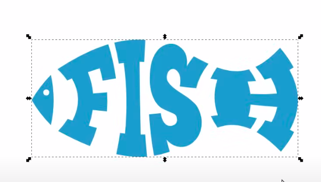

# Graphic design
Graphic design is the art and practice of visual communication, using typography, imagery, color, and layout to convey messages or information. It encompasses various forms of visual communication, including print design, digital design, branding, advertising and web design.

## 1. Vector graphic design
Unlike **raster graphics** (like JPEG or PNG images), which are made up of pixels, **vector graphics** are composed of mathematical paths that define shapes, lines, curves, and colors. 

Paths paths can be resized, scaled, and manipulated without losing image quality, making vector graphics ideal for illustrations, logos, diagrams, typography, and other graphic design tasks.

[Inkscape](https://inkscape.org/) is a prominent FOSS for vector graphic design.

### 1.1 Inkscape
Deformate a text to match a shape [YouTube](https://youtu.be/l3BHcregNUs).
- Transform the Text to Path (Shift + Ctrl + C)
- Launch path effect (shift ctrl 7)
- Add effect: Enveloppe Deformation
- click F2 (tool_node) and bend top and bottom path

  

### 1.2 Corel Draw/Photo
The software is presenting an "Illegal Software" message offering me amnesty and such. Delete Corel message folder to correct the issue.
1) Press Windows key + R.
2) Type %appdata% and hit enter.
3) Go to Corel folder.
4) Delete the "Messages" folder

## 2. Raster graphic design
**Raster graphics** (like JPEG or PNG images) are made up of pixels. Each pixel holds one or multiple values depending on the color model (RGB, RGBA, or, for printing, CMYK) used and the bit depth of the image.

The bit depth is the value range pixel can represent:
- 8-bit color: Each color channel (red, green, blue) is represented by 8 bits, allowing for 256 possible values per channel. This results in 16.7 million possible colors (256^3).
- 16-bit color: Each color channel is represented by 16 bits, allowing for 65,536 possible values per channel. This results in a much wider range of colors and smoother gradients than 8-bit color.
- 32-bit color (RGBA): Each color channel is typically represented by 8 bits, with an additional 8-bit alpha channel for transparency. This allows for 256 levels of transparency in addition to the 16.7 million colors available in 8-bit RGB.

[GIMP](https://www.gimp.org/) is a prominent FOSS for raster graphic design.