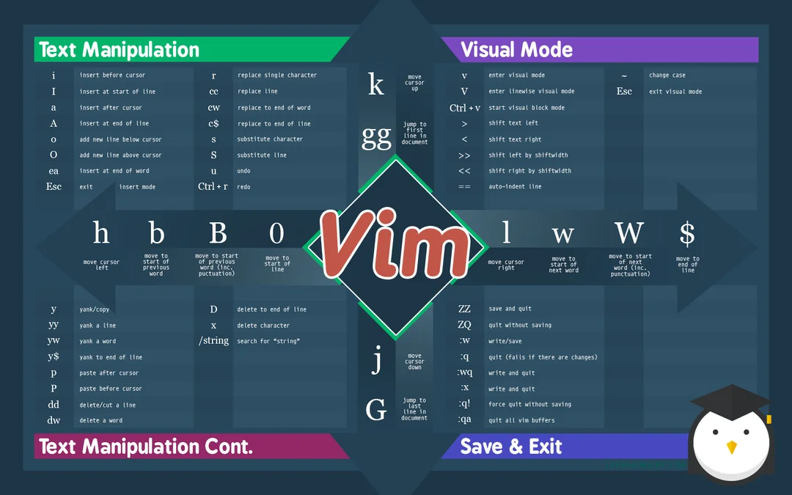

# Vim - the ubiquitous text editor
Vim is a modal editor centered on efficiently doing all via the keyboard.

Based on the original Unix text editor Vi, which came about in 1976 by Bill Joy.
Vim (Vi improved) followed it in 1991 by Bram Moolenaar.

In Ubuntu `sudo apt get neovim` ([doc](https://github.com/neovim/neovim/blob/master/INSTALL.md)).

Check Primeagen's [Vim As Your Editor](https://www.youtube.com/watch?v=X6AR2RMB5tE&list=PLm323Lc7iSW_wuxqmKx_xxNtJC_hJbQ7R&index=1) playlist.

Normal, Insert, Visual, Command
||||
|---|---|---|
||k||
|h|j|l|


## NeoVim Editor
[0 to lsp: Neovim RC From Scratch](https://youtu.be/w7i4amO_zaE)  
`%` create a new file  
`d` create a dir  
`:Ex` go to Explorer (remapped to `<leader>pv` while on Normal)  
`o` open the file in new buffer

```sh
cd ~/.config
mkdir nvim
cd nvim
nvim .

# Any dir inside lua/ can be loaded by lua via `require`
#  "init.lua" are like index.html or __init__.py
```
In view of its discontinuation, plugin manager [Packer](https://github.com/wbthomason/packer.nvim)'s README recommends [Lazy Vim](https://github.com/folke/lazy.nvim).

Visual Line + `=` -> aligns text

after dir should be in lua/
try out telescope keybindings from "after/telescope" (C-p is CTRL+P)

LazyVim does not typically uses "after". It uses its modular structure.
# TODO:

Organize this .MD
Check Harpoon keybinds and how it works  
Check telescope keybinds and take note   
Leader u (see branch of undotree)  
Leader gs (fugitive, for git control)  

LSP provides autocompletion (C-n and C-p to navigate; C-y to accept; C-e to cancel)  
LSP-zero has 3 dependencies, and each desired LSP server must be download separate and a `require('lspconfig').example_server.setup({})` must be added to LazyVim's plugin spec.


<div align="center">
  
</div>

= indent code
f h <-- goes to next "h"

install brew in linux, install 
https://brew.sh/

"insert vertical mode"
enter visual block mode (ctrl+v or ctrl+q), highlight text, "shift + i", type it and hit Esc


## Vim Modes
Enter Normal mode: `ESC` or `Ctrl + C`  
Enter Command mode with `:`

|Insert Mode||
|---|---|
|i|before caret|
|I| beginning of line|
|a|after caret|
|A| end of the line |
|o|insert in next line|
|O| insert in line above|

|Visual Mode||
|---|---|
|v|visual|
|ctrl + v| visual block|
|shift + v|visual line|

[Command] + [count] + [Motion]

For instance, `dt(` will delete up to the next ( in line

What is a motion?

Commands: D C Y V  
(`.` repeats any operation done in Normal Mode)

DELETE
- word: `d i w`
- sentence: `d i s`
- paragraph: `d i p`

CHANGE
- word: `c w` + "new word"

YANK
- all inside (, [, or a {: `y + i + ( [ {`
- all inside incuding braces: `y + i + ( [ {`


VERTICAL NAVIGATION
- sentence: `(` & `)`
- paragraph: `{` & `}`  (next block of blank line)
- half-page: ctrl + d/u
- full-age: ctrl + f/b
- go to beginning of the page: gg
- go to end of the page:G

undo - U  
redo - ctrl + R

MARK (normal mode)
- mark-current-position with a: `m a`
- jump-to mark-a: `~a`
- toggle last cursor position: `~~`
- go-to last edit position: `~.`

SEARCH
- `f` + character (`;` forward, `,` backward) _(inverse `F`)_
- `t` + character (jumps to but not on top) _(inverse `T`)_
- `/pattern` (iterate by typing `n`/`N`)
- search for the next word like the current word `*` (`#`, backwards)


# change in a word
c i w

Then, if I go to any word and click ".", the last operation will run again


### Sheetcode
|command | description|
|---|---|
|hjkl| navigation |
|I| start insert mode at the beginning of line|
|a| insert mode after the word|
|A| insert mode at the end of the line|
|R| replace the selected cursor|
|:q | quit an unmodified file|
|:q! | quit and discard changes|
|:wq | write the changes and quit|
|x | delete character|
|dd | delete line|
|u | undo it|
|:set number | add line numbers|
|:2 | goto line 2|
|+p | paste|
|:w | write/save|
|:!node hello.js | runs a shell command directly from Vim|

## Setup Vim in VS Code
- Add extension "vscodevim.vim"  
- Setup key-repeat  
On Google, search for "vscode vim github". Open repository "VSCodeVim/Vim"  
Scroll down to installation section, find your OS, perform the steps.  
Restart VSCode for changes to take effect: `>reload`  
Caret should be wider.  

- Remap "jh" to "ESC"  
```vim
" Add a recursive mapping "jh" only to Insert Mode
:inoremap jh <Esc>
" Remove the recursive mapping "jh"
:iunmap jh      
```

Vimrc

goto `.config/nvim`, create `init.lua` and a folder `lua`.
inside it create a folder with your username. Inside it, create `init.lua` and `remap.lua`
```lua
-- .config/nvim/profile/init.lua
require("juliano.remap")
print("hello from juliano")

-- .config/nvim/profile/remap.lua
vim.g.mapleader = " "
vim.keymap.set("n", "<leader>pv", vim.cmd.Ex)
```
